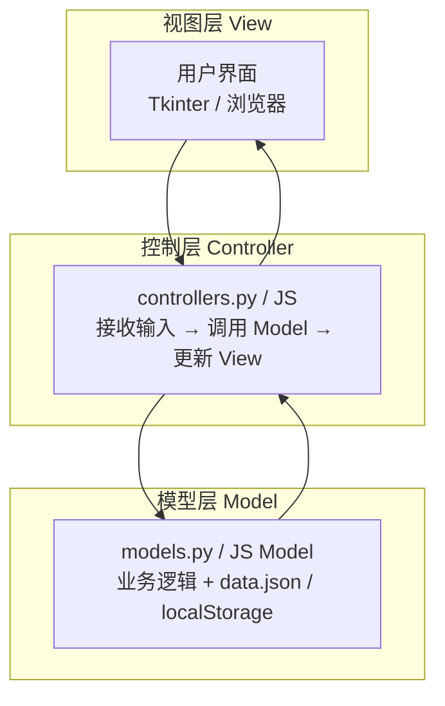
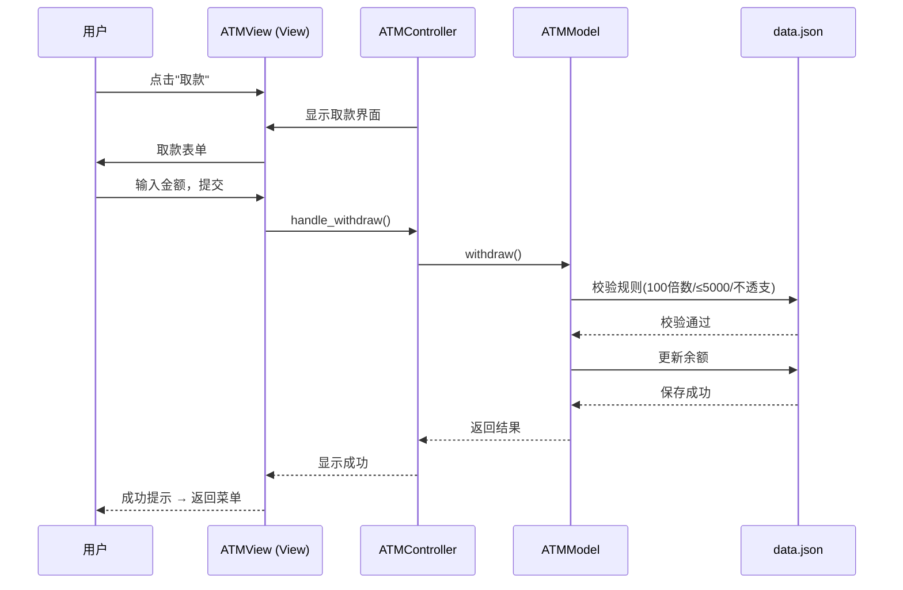
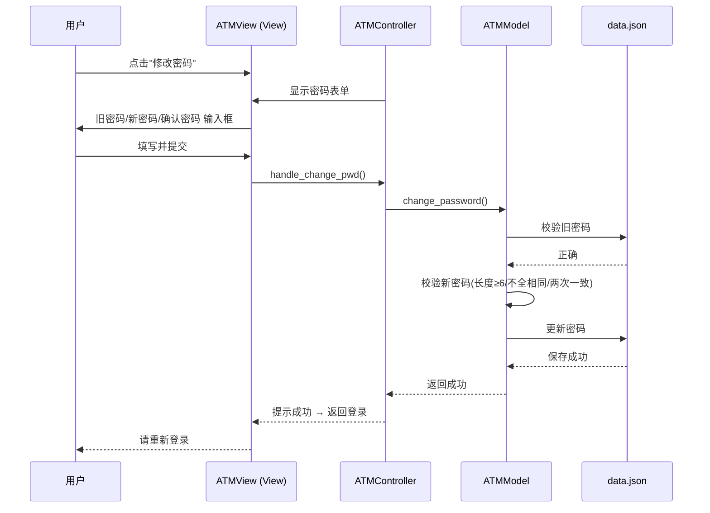
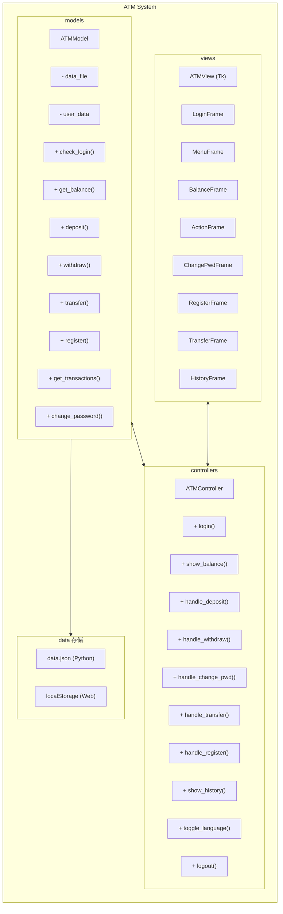
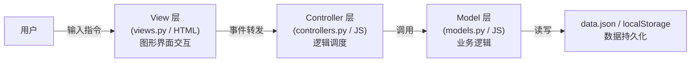
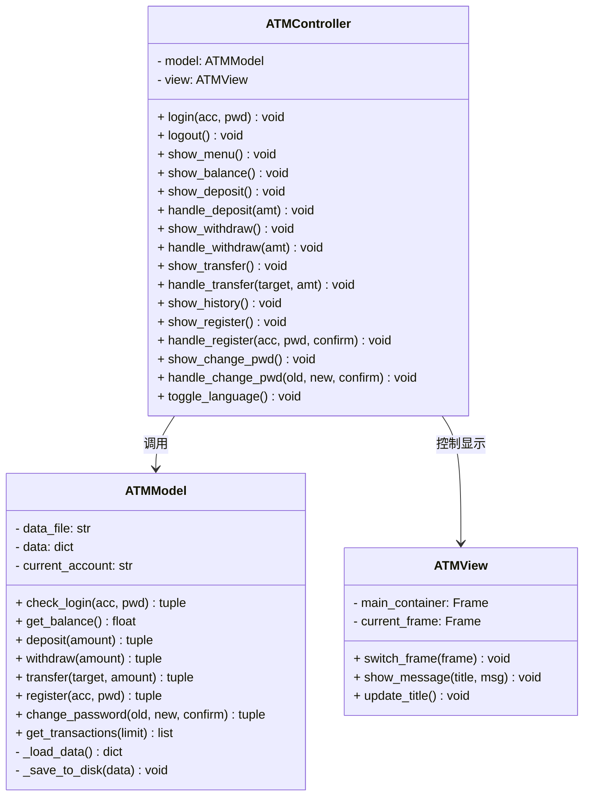
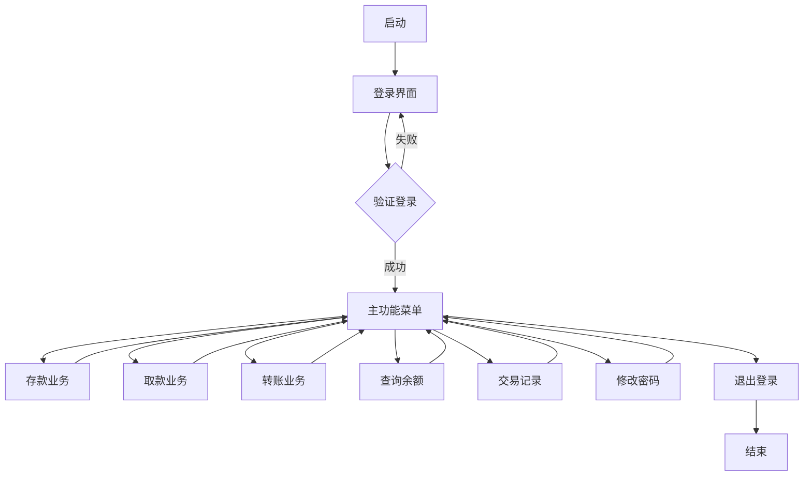

# ATM 柜员机模拟程序

**软件设计实践报告**

单 位：计算机·网络空间安全学院

班 级：2023 级计算机科学与技术 1 班

|        |            |            |
| ------ | ---------- | ---------- |
| 组长   | （填学号） | （填姓名） |
| 组员 1 | （填学号） | （填姓名） |
| 组员 2 | （填学号） | （填姓名） |
| 组员 3 | （填学号） | （填姓名） |
| 组员 4 | （填学号） | （填姓名） |

任课教师：陈姝

湘 潭 大 学

2026 年 7 月

---

## 目录

1. [项目概述](#1-项目概述)
2. [项目小组成员及各自工作](#2-项目小组成员及各自工作)
3. [项目工作进度](#3-项目工作进度)
4. [项目代码托管地址](#4-项目代码托管地址)
5. [软件演示视频连接](#5-软件演示视频连接)
6. [需求分析](#6-需求分析)
7. [系统设计](#7-系统设计)
8. [详细设计](#8-详细设计)
9. [代码实现](#9-代码实现)
10. [测试](#10-测试)
11. [软件运行效果与使用说明](#11-软件运行效果与使用说明)
12. [设计体会](#12-设计体会)
13. [参考文献](#13-参考文献)
14. [附录](#14-附录)

---

## 1. 项目概述

### 1.1 概述

ATM（Automatic Teller Machine，自动柜员机）是银行业务中最重要的自助服务终端之一。随着金融科技的快速发展，ATM 系统的软件架构设计对系统的可维护性、可扩展性和稳定性提出了更高要求。

本项目开发了一款 ATM 柜员机模拟程序，严格遵循 **MVC（Model-View-Controller）设计模式**，实现了业务逻辑与界面呈现的深度解耦。系统支持用户登录、余额查询、存款、取款和修改密码等核心功能，并采用 JSON 文件进行本地数据持久化。

项目具有以下特点：

- **MVC 三层架构**：模型层、视图层、控制层职责清晰，符合软件工程"高内聚、低耦合"的设计原则
- **双端实现**：同时提供 Python Tkinter 桌面版和 Web 前端版，同一套业务逻辑在两套前端下运行
- **零第三方依赖**：桌面版完全基于 Python 3 标准库开发，无需安装任何第三方包
- **严格遵循业务规则**：取款 100 倍数、单笔上限 5000 元、不可透支、密码强度检测等规则均在模型层实现

### 1.2 目的和用途

**目的**：通过开发 ATM 柜员机模拟程序，将软件工程课程中所学的 MVC 设计模式、需求分析、系统设计、软件测试等理论知识付诸实践，提升软件项目的综合开发能力。

**用途**：本系统可作为银行 ATM 系统的教学演示模型，帮助理解 ATM 业务处理流程和软件架构设计方法。

---

## 2. 项目小组成员及各自工作

| 姓名 | 学号 | 工作内容 | 自评 |
| --- | --- | --- | --- |
| （组长） | （填学号） | 系统架构设计、MVC 模式实现、控制器与模型层开发、项目统筹与文档撰写 | 优 |
| （组员 1） | （填学号） | 视图层界面开发、Tkinter 布局与交互、UI 设计与用户体验优化 | 优 |
| （组员 2） | （填学号） | Web 前端改造、HTML/CSS/JS 开发、PPT 制作与演示视频录制 | 优 |
| （组员 3） | （填学号） | 需求分析、用例模型设计、测试用例设计与执行、Bug 跟踪 | 优 |
| （组员 4） | （填学号） | 数据持久化方案设计、系统测试、运行环境配置、文档排版与校对 | 优 |

---

## 3. 项目工作进度

| 时间                    | 里程碑                       |
| ----------------------- | ---------------------------- |
| 2026.05.01 — 2026.05.07 | 选题确定、需求分析、功能规划 |
| 2026.05.08 — 2026.05.14 | MVC 架构设计、核心类结构设计 |
| 2026.05.15 — 2026.05.21 | 模型层与数据持久化开发       |
| 2026.05.22 — 2026.05.28 | 视图层 Tkinter 界面开发      |
| 2026.05.29 — 2026.06.04 | 控制层逻辑调度与集成测试     |
| 2026.06.05 — 2026.06.11 | Web 前端改造、界面美化       |
| 2026.06.12 — 2026.06.18 | 系统测试、Bug 修复、文档撰写 |
| 2026.06.19 — 2026.06.25 | PPT 制作、演示视频录制       |

---

## 4. 项目代码托管地址

GitHub 仓库：[https://github.com/（请填入实际地址）]（https://github.com/（请填入实际地址））

---

## 5. 软件演示视频连接

B站视频链接：[https://www.bilibili.com/video/（请填入实际地址）]（https://www.bilibili.com/video/（请填入实际地址））

---

## 6. 需求分析

### 6.1 系统功能概述

ATM 柜员机模拟程序需要满足以下功能需求：

1. **登录功能**：用户输入卡号和密码进行身份验证，连续 3 次失败将锁定账户 3 分钟
2. **查询余额**：显示当前账户余额，初始余额为 10000 元
3. **ATM 取款**：用户输入取款金额，系统校验后扣减余额
4. **ATM 存款**：用户输入存款金额，系统校验后增加余额
5. **转账业务**：用户输入目标账号和金额，系统校验后完成跨账户转账
6. **交易记录**：用户可查询历史交易明细（存入、取出、转账）
7. **注册新账户**：用户可自助注册新银行卡账户
8. **修改密码**：用户验证旧密码后设置新密码
9. **多语言支持**：支持中文/英文界面切换

### 6.2 用例模型

#### 用例表 1：用户登录

|                    |                                                        |
| ------------------ | ------------------------------------------------------ |
| **用例编号与名称** | UC1 用户登录                                           |
| **范围**           | ATM 柜员机系统                                         |
| **级别**           | 用户目标                                               |
| **主要参与者**     | 银行卡用户                                             |
| **涉众及其关注点** | 用户希望通过输入卡号和密码登录系统；系统需保证账号安全 |
| **前置条件**       | 用户持有合法银行卡（卡号和密码已知）                   |
| **成功保证**       | 账号和密码验证通过，进入主菜单界面                     |
| **主成功场景**     | 用户输入卡号和密码 → 系统验证通过 → 显示功能菜单       |
| **扩展**           | 卡号或密码错误 → 系统提示"账号或密码不正确"；连续 3 次错误 → 锁定账户 3 分钟 |
| **特殊需求**       | 支持键盘输入，密码输入时显示为掩码                     |
| **发生频率**       | 每次使用系统时                                         |

#### 用例表 2：查询余额

|                    |                                                      |
| ------------------ | ---------------------------------------------------- |
| **用例编号与名称** | UC2 查询余额                                         |
| **范围**           | ATM 柜员机系统                                       |
| **级别**           | 用户目标                                             |
| **主要参与者**     | 银行卡用户                                           |
| **涉众及其关注点** | 用户希望快速查看当前账户余额                         |
| **前置条件**       | 用户已成功登录                                       |
| **成功保证**       | 系统准确显示当前余额                                 |
| **主成功场景**     | 用户选择"查询余额" → 系统显示余额信息 → 用户返回菜单 |
| **扩展**           | 无                                                   |
| **发生频率**       | 每次登录期间可能多次使用                             |

#### 用例表 3：ATM 取款

|                    |                                                                                   |
| ------------------ | --------------------------------------------------------------------------------- |
| **用例编号与名称** | UC3 ATM 取款                                                                      |
| **范围**           | ATM 柜员机系统                                                                    |
| **级别**           | 用户目标                                                                          |
| **主要参与者**     | 银行卡用户                                                                        |
| **涉众及其关注点** | 用户需要提取现金；系统需确保交易安全合规                                          |
| **前置条件**       | 用户已成功登录                                                                    |
| **成功保证**       | 余额扣除成功，取款金额满足业务规则约束                                            |
| **主成功场景**     | 用户选择"取款业务" → 输入金额 → 系统校验通过 → 扣减余额 → 显示成功信息            |
| **扩展**           | 金额不是 100 的倍数 → 提示错误；金额超过 5000 → 提示错误；余额不足 → 提示不可透支 |
| **特殊需求**       | 金额输入必须为数字                                                                |
| **发生频率**       | 每次登录期间可能使用 1-2 次                                                       |

#### 用例表 4：ATM 存款

|                    |                                                                        |
| ------------------ | ---------------------------------------------------------------------- |
| **用例编号与名称** | UC4 ATM 存款                                                           |
| **范围**           | ATM 柜员机系统                                                         |
| **级别**           | 用户目标                                                               |
| **主要参与者**     | 银行卡用户                                                             |
| **涉众及其关注点** | 用户需要存入现金；系统需确保金额正确                                   |
| **前置条件**       | 用户已成功登录                                                         |
| **成功保证**       | 余额增加成功，存款金额为正数                                           |
| **主成功场景**     | 用户选择"存款业务" → 输入金额 → 系统校验通过 → 增加余额 → 显示成功信息 |
| **扩展**           | 金额为负数或零 → 提示"存款金额必须大于 0"                              |
| **发生频率**       | 每次登录期间可能使用 1-2 次                                            |

#### 用例表 5：修改密码

|                    |                                                                                                   |
| ------------------ | ------------------------------------------------------------------------------------------------- |
| **用例编号与名称** | UC5 修改密码                                                                                      |
| **范围**           | ATM 柜员机系统                                                                                    |
| **级别**           | 用户目标                                                                                          |
| **主要参与者**     | 银行卡用户                                                                                        |
| **涉众及其关注点** | 用户需要更改账户密码；系统需确保密码安全合规                                                      |
| **前置条件**       | 用户已成功登录                                                                                    |
| **成功保证**       | 旧密码验证通过，新密码符合强度规则，两次输入一致                                                  |
| **主成功场景**     | 用户选择"修改密码" → 输入旧密码/新密码/确认密码 → 校验通过 → 密码更新 → 强制重新登录              |
| **扩展**           | 旧密码错误 → 提示；新密码长度小于 6 位 → 提示；新密码为完全相同字符 → 提示；两次输入不一致 → 提示 |
| **发生频率**       | 偶尔使用                                                                                          |

#### 用例表 6：转账业务

|                    |                                                                                   |
| ------------------ | --------------------------------------------------------------------------------- |
| **用例编号与名称** | UC6 转账业务                                                                      |
| **范围**           | ATM 柜员机系统                                                                    |
| **级别**           | 用户目标                                                                          |
| **主要参与者**     | 银行卡用户                                                                        |
| **涉众及其关注点** | 用户需要向他人转账；系统需确保交易安全和目标账户合法                              |
| **前置条件**       | 用户已成功登录                                                                    |
| **成功保证**       | 转出方余额扣除，转入方余额增加，双方均生成交易记录                                |
| **主成功场景**     | 用户选择"转账业务" → 输入目标账号和金额 → 系统校验通过 → 扣减/增加余额 → 显示成功 |
| **扩展**           | 目标账号不存在 → 提示；转账给自己 → 提示；金额不为100倍数 → 提示；超过5000 → 提示；余额不足 → 提示 |
| **发生频率**       | 每次登录期间可能使用 1-2 次                                                       |

#### 用例表 7：交易记录查询

|                    |                                                                        |
| ------------------ | ---------------------------------------------------------------------- |
| **用例编号与名称** | UC7 交易记录查询                                                       |
| **范围**           | ATM 柜员机系统                                                         |
| **级别**           | 用户目标                                                               |
| **主要参与者**     | 银行卡用户                                                             |
| **涉众及其关注点** | 用户希望了解账户的历史变动明细                                         |
| **前置条件**       | 用户已成功登录                                                         |
| **成功保证**       | 系统按时间倒序显示最近的 50 条交易记录                                 |
| **主成功场景**     | 用户选择"交易记录" → 系统查询并展示历史交易 → 用户浏览后返回           |
| **扩展**           | 无交易记录 → 显示"暂无交易记录"                                        |
| **发生频率**       | 每次登录期间可能使用 1 次                                              |

#### 用例表 8：注册新账户

|                    |                                                                        |
| ------------------ | ---------------------------------------------------------------------- |
| **用例编号与名称** | UC8 注册新账户                                                         |
| **范围**           | ATM 柜员机系统                                                         |
| **级别**           | 用户目标                                                               |
| **主要参与者**     | 新用户                                                                 |
| **涉众及其关注点** | 新用户希望自助开卡；系统需确保账号唯一且密码合规                       |
| **前置条件**       | 位于登录界面                                                           |
| **成功保证**       | 新账号创建成功，自动登录并进入主菜单                                   |
| **主成功场景**     | 用户点击"注册新账户" → 填写账号/密码/确认密码 → 校验通过 → 注册成功 → 自动登录 |
| **扩展**           | 账号已存在 → 提示；密码长度<6 → 提示；两次密码不一致 → 提示；账号包含非法字符 → 提示 |
| **发生频率**       | 偶尔使用                                                              |

### 6.3 补充性规格说明

**可用性**：

- 界面简洁明了，所有功能通过按钮点击即可完成
- 输入框具有焦点提示和占位符说明
- 错误消息以弹窗形式清晰展示
- 支持中文/英文双语界面切换

**可靠性**：

- 数据通过 JSON 文件持久化，程序异常退出不会丢失数据
- 前端验证与后端验证双层校验，防止非法数据
- 密码输入使用掩码显示，防止偷窥
- 账户连续 3 次密码错误自动锁定 3 分钟，防止暴力破解

**业务规则**（详见 6.4 节）：

- 取款：100 的倍数，单次 ≤5000，不可透支
- 存款：金额必须大于 0
- 转账：100 的倍数，单次 ≤5000，不可透支，不可转给自己
- 修改密码：长度 ≥6，不全相同字符，旧密码正确，两次输入一致
- 登录锁定：连续 3 次密码错误锁定 3 分钟

### 6.4 业务规则

| 编号 | 规则名称     | 规则描述                                     |
| ---- | ------------ | -------------------------------------------- |
| BR1  | 取款金额倍数 | 每次取款金额必须是 100 的整数倍              |
| BR2  | 单次取款上限 | 单次取款金额不得超过 5000 元                 |
| BR3  | 不透支       | 取款金额不得超过当前账户余额                 |
| BR4  | 存款正数     | 存款金额必须大于 0                           |
| BR5  | 密码长度     | 新密码长度至少为 6 位                        |
| BR6  | 密码复杂度   | 新密码不能为 6 位完全相同的字符（如 111111） |
| BR7  | 密码一致性   | 两次输入的新密码必须完全一致                 |
| BR8  | 旧密码验证   | 修改密码前必须验证旧密码正确                 |
| BR9  | 转账金额倍数 | 每次转账金额必须是 100 的整数倍              |
| BR10 | 单笔转账上限 | 单笔转账金额不得超过 5000 元                 |
| BR11 | 转账不自转   | 不能转账给自己                               |
| BR12 | 登录锁定     | 连续 3 次密码错误锁定账户 3 分钟             |

---

## 7. 系统设计

### 7.1 系统架构

本系统采用 **MVC（Model-View-Controller）三层架构**，将数据、界面和控制逻辑分离：



**三层职责**：

| 层次       | 文件           | 职责                                        |
| ---------- | -------------- | ------------------------------------------- |
| Model      | models.py      | 管理核心数据与业务规则，封装 JSON 文件读写  |
| View       | views.py       | 负责 Tkinter GUI 布局与呈现，不含业务逻辑   |
| Controller | controllers.py | 作为 Model 和 View 的桥梁，调度处理用户请求 |

### 7.2 系统时序图

#### 取款业务时序图



#### 修改密码时序图



### 7.3 包图



### 7.4 逻辑分层

**顶层数据流图**：



---

## 8. 详细设计

### 8.1 类图




### 8.2 交互图

**登录交互**：

```
用户 → LoginFrame: 输入账号和密码
LoginFrame → ATMController: 调用 login(acc, pwd)
ATMController → ATMModel: 调用 check_login(acc, pwd)
ATMModel → ATMController: 返回验证结果
ATMController → ATMView: switch_frame(MenuFrame) 或 show_message(错误)
ATMView → 用户: 显示主菜单或错误提示
```

**存款交互**：

```
用户 → ActionFrame: 输入存款金额并提交
ActionFrame → ATMController: 调用 handle_deposit(amount_str)
ATMController → ATMModel: 调用 deposit(amount)
ATMModel → ATMController: 返回 (success, message)
ATMController → ATMView: show_message 或 switch_frame(MenuFrame)
ATMView → 用户: 显示结果

```

### 8.3 UI 设计

**设计原则**：

- **桌面版**（Tkinter）：采用简洁的功能按钮布局，主窗口尺寸 520×500，不可缩放。每个功能对应独立的 Frame，通过 switch_frame 统一切换。按钮使用色彩区分（绿色登录、蓝色提交、橙色修改密码）。
- **Web 版**：采用暗色奢华设计风格，毛玻璃卡片 + 金色点缀，Canvas 动态光晕背景，毛玻璃卡片，页面切换动画，响应式适配手机和桌面。

**界面列表**：

| 界面        | 桌面版                           | Web 版                                  |
| ----------- | -------------------------------- | --------------------------------------- |
| 登录        | 账号输入 + 密码输入 + 注册按钮   | 居中卡片，AETHER 品牌标识，毛玻璃效果   |
| 注册        | 账号/密码/确认输入 + 注册/返回   | 三步表单，注册成功自动登录               |
| 主菜单      | 6 个功能按钮网格 + 语言/退出     | 2×3 网格 + 底部语言切换/退出按钮        |
| 余额查询    | 大字体余额显示 + 返回按钮        | 金色衬线字体大号余额 + 装饰线条         |
| 存款/取款   | 金额输入框 + 提交/返回按钮       | 居中输入框 + 确认/返回按钮              |
| 转账        | 目标账号 + 金额输入 + 确认/返回  | 双输入表单 + 转账限额提示               |
| 交易记录    | 滚动文本框按时间倒序展示         | 滚动区域，时间/类型/金额/余额列示       |
| 修改密码    | 三个密码输入框 + 确认/返回按钮   | 三段式表单 + 安全中心标识               |

### 8.4 数据设计

**数据结构**（JSON 格式）：

```json
{
  "users": [
    {
      "account": "123456",
      "password": "123456",
      "balance": 10000.0,
      "failed_attempts": 0,
      "locked_until": null
    }
  ],
  "transactions": [
    {
      "account": "123456",
      "type": "deposit",
      "amount": 2000,
      "target": null,
      "balance_after": 12000.0,
      "timestamp": "2026-06-01 10:30:00"
    }
  ],
  "next_account": 123457
}
```

- **用户列表**：`users` 数组存储多账户，每个账户含账号、密码、余额、失败次数、锁定时间
- **交易记录**：`transactions` 数组存储所有账户的交易日志，按时间倒序查询
- **自动迁移**：检测到旧版单用户格式（含 `account` 字段）自动转换为新版多用户格式
- Python 版通过 `json` 库读写本地 `data.json` 文件
- Web 版通过 `localStorage.setItem/getItem` 在浏览器中存储

---

## 9. 代码实现

### 9.1 系统流程图



### 9.2 核心代码解析

#### 模型层（models.py）

```python
class ATMModel:
    """
    模型层：管理核心数据与业务规则。
    封装 data.json 的读写操作，所有业务判断在此完成。
    """
    def __init__(self, data_file="data.json"):
        self.data_file = data_file
        self.initial_data = {
            "account": "123456",
            "password": "123456",
            "balance": 10000.0
        }
        self.user_data = self._load_data()

    def check_login(self, account, password):
        """登录验证"""
        return account == self.user_data["account"] \
           and password == self.user_data["password"]

    def withdraw(self, amount):
        """
        取款业务规则：
        1. 金额 > 0
        2. 100 的倍数
        3. 单次 ≤ 5000
        4. 不可透支
        """
        if amount <= 0:
            return False, "金额无效"
        if amount % 100 != 0:
            return False, "取款金额必须是100的倍数"
        if amount > 5000:
            return False, "单次取款不能超过5000元"
        if amount > self.user_data["balance"]:
            return False, "余额不足，不可透支"

        self.user_data["balance"] -= amount
        self._save_to_disk(self.user_data)
        return True, f"取款成功，当前余额: {self.user_data['balance']:.2f}元"

    def change_password(self, old_pwd, new_pwd, confirm_pwd):
        """
        修改密码规则：
        1. 旧密码必须正确
        2. 新密码长度 ≥ 6
        3. 不能是 6 位完全相同字符
        4. 两次输入必须一致
        """
        if old_pwd != self.user_data["password"]:
            return False, "旧密码输入错误"
        if new_pwd != confirm_pwd:
            return False, "两次输入的新密码不一致"
        if len(new_pwd) < 6:
            return False, "新密码长度至少需要6位"
        if len(set(new_pwd)) == 1:
            return False, "新密码不能是完全相同的字符"

        self.user_data["password"] = new_pwd
        self._save_to_disk(self.user_data)
        return True, "密码修改成功，请重新登录"
```

**设计亮点**：所有业务规则集中在 Model 层实现，View 层完全不包含逻辑判断。当业务规则变更时，只需修改 Model 层代码，不影响界面。

#### 视图层（views.py）

```python
import tkinter as tk
from tkinter import messagebox

class ATMView(tk.Tk):
    """视图层：Tkinter 图形界面，仅负责展示和事件转发"""
    def __init__(self):
        super().__init__()
        self.title("大学生软件工程项目 - ATM柜员机模拟程序")
        self.geometry("450x400")
        self.resizable(False, False)
        self.main_container = tk.Frame(self)
        self.main_container.pack(fill="both", expand=True)
        self.current_frame = None

    def switch_frame(self, frame_class, *args, **kwargs):
        """统一切换界面：销毁当前 Frame，创建新的 Frame"""
        new_frame = frame_class(self.main_container, *args, **kwargs)
        if self.current_frame is not None:
            self.current_frame.destroy()
        self.current_frame = new_frame
        self.current_frame.pack(fill="both", expand=True)
```

**设计亮点**：`switch_frame` 方法实现了统一界面切换，每个界面对应一个 Frame 子类。View 层不包含任何业务逻辑判断，只做显示和事件转发。

#### 控制层（controllers.py）

```python
class ATMController:
    """
    控制层：Model 和 View 的桥梁。
    接收 View 的用户请求 → 调用 Model 处理 → 指示 View 更新。
    """
    def __init__(self, model, view):
        self.model = model
        self.view = view
        self.view.switch_frame(LoginFrame, self)

    def handle_deposit(self, amount_str):
        """处理存款：解析输入 → 调用 Model → 反馈结果"""
        try:
            amount = float(amount_str)
            success, msg = self.model.deposit(amount)
            if success:
                self.view.show_message("成功", msg)
                self.show_menu()
            else:
                self.view.show_message("错误", msg, is_error=True)
        except ValueError:
            self.view.show_message("错误", "请输入有效的数字金额", is_error=True)
```

**设计亮点**：Controller 接收字符串输入，进行格式解析后调用 Model 的业务方法。处理结果由 Controller 决定 View 如何呈现（成功弹窗/失败弹窗 + 界面跳转）。

#### Web 前端版（index.html）

Web 版沿用了同样的 MVC 架构，使用 JavaScript 实现：

```javascript
// Model 封装 — 对应 models.py
const STORAGE_KEY = "aether_atm";
let data = loadData();

function loadData() {
  const raw = localStorage.getItem(STORAGE_KEY);
  return raw ? JSON.parse(raw) : defaultData;
}

function saveData(data) {
  localStorage.setItem(STORAGE_KEY, JSON.stringify(data));
}

// View — 每个 #screen-* 对应一个界面，showScreen() 切换
function showScreen(id) {
  /* 切换显示对应 screen */
}

// Controller — 事件监听处理
document.getElementById("withdraw-submit").addEventListener("click", () => {
  const amount = parseInt(input.value, 10);
  if (amount % 100 !== 0) {
    /* 显示错误 */ return;
  }
  if (amount > 5000) {
    /* 显示错误 */ return;
  }
  if (amount > data.balance) {
    /* 显示错误 */ return;
  }
  data.balance -= amount;
  saveData(data);
  /* 显示成功信息 */
});
```

**设计亮点**：Web 版使用 `localStorage` 替代 `data.json` 实现数据持久化，使用 HTML/CSS 替代 Tkinter 实现界面渲染。业务逻辑代码结构保持一致，MVC 分层在 JavaScript 中清晰可见。

#### 新增功能：转账与多账户（models.py）

```python
def transfer(self, target_account, amount):
    """转账业务：校验目标账户是否存在及交易规则"""
    user = self._get_current_user()
    if target_account == user["account"]:
        return False, "不能转账给自己"
    if amount <= 0:
        return False, "金额无效"
    if amount % 100 != 0:
        return False, "转账金额必须是100的倍数"
    if amount > 5000:
        return False, "单笔转账不能超过5000元"
    if amount > user["balance"]:
        return False, "余额不足"
    target = self._find_user(target_account)
    if not target:
        return False, "目标账号不存在"
    user["balance"] -= amount
    target["balance"] += amount
    self._log_transaction("transfer_out", amount, user["balance"], target_account)
    self._log_transaction_for(target_account, "transfer_in", amount,
                              target["balance"], user["account"])
    return True, amount
```

#### 新增功能：登录锁定（models.py）

```python
LOCKOUT_MINUTES = 3
LOCKOUT_ATTEMPTS = 3

def check_login(self, account, password):
    user = self._find_user(account)
    # 检查是否锁定
    if user.get("locked_until"):
        remaining = user["locked_until"] - time.time()
        if remaining > 0:
            mins = int(remaining // 60) + 1
            return False, ("locked", mins)
        else:
            user["locked_until"] = None
            user["failed_attempts"] = 0
    if password == user["password"]:
        user["failed_attempts"] = 0
        self.current_account = account
        return True, ""
    else:
        user["failed_attempts"] += 1
        if user["failed_attempts"] >= LOCKOUT_ATTEMPTS:
            user["locked_until"] = time.time() + LOCKOUT_MINUTES * 60
            return False, ("locked", LOCKOUT_MINUTES)
        return False, "账号或密码不正确"
```

**设计亮点**：锁定机制使用 `time.time()` 时间戳记录锁定截止时刻，每次登录前检查是否已过锁定期。3 次错误自动锁定 3 分钟，有效防止暴力破解。

#### 新增功能：多语言切换（lang.py）

```python
STRINGS = {
    'zh': {'login_title': '欢迎使用ATM模拟系统', 'menu_balance': '查询余额', ...},
    'en': {'login_title': 'Welcome to ATM System', 'menu_balance': 'Balance', ...}
}

def tr(key, *args):
    s = STRINGS.get(_current_lang, {}).get(key, key)
    return s % args if args else s
```

**设计亮点**：所有界面文案以键值对形式集中管理，Controller 通过 `tr()` 函数动态获取翻译文本。切换语言时重绘当前 Frame，实现即时中英文切换。Python 和 Web 版共用相同的字符串字典设计模式。

---

## 10. 测试

### 10.1 测试环境

| 项目             | 配置                      |
| ---------------- | ------------------------- |
| 操作系统         | Ubuntu 22.04 / Windows 11 |
| Python 版本      | 3.10+                     |
| 硬件             | x86_64 架构               |
| 浏览器（Web 版） | Chrome 120+ / Edge 120+   |

### 10.2 测试用例

#### 登录功能测试

| 编号 | 测试用例 | 输入                       | 预期结果               | 实际结果 |
| ---- | -------- | -------------------------- | ---------------------- | -------- |
| TC01 | 正确登录 | 账号: 123456, 密码: 123456 | 成功进入主菜单         | ✅ 通过  |
| TC02 | 错误账号 | 账号: 000000, 密码: 123456 | 提示"账号或密码不正确" | ✅ 通过  |
| TC03 | 错误密码 | 账号: 123456, 密码: 000000 | 提示"账号或密码不正确" | ✅ 通过  |
| TC04 | 空输入   | 账号: (空), 密码: (空)     | 提示"请输入账号和密码" | ✅ 通过  |

#### 取款功能测试

| 编号 | 测试用例    | 输入              | 预期结果              | 实际结果 |
| ---- | ----------- | ----------------- | --------------------- | -------- |
| TC05 | 合法取款    | 金额: 1000        | 成功扣减余额          | ✅ 通过  |
| TC06 | 非 100 倍数 | 金额: 250         | 提示"必须是100的倍数" | ✅ 通过  |
| TC07 | 超过 5000   | 金额: 6000        | 提示"不能超过5000元"  | ✅ 通过  |
| TC08 | 余额不足    | 余额 100 时取 200 | 提示"余额不足"        | ✅ 通过  |
| TC09 | 负数取款    | 金额: -100        | 提示"金额无效"        | ✅ 通过  |

#### 存款功能测试

| 编号 | 测试用例 | 输入       | 预期结果        | 实际结果 |
| ---- | -------- | ---------- | --------------- | -------- |
| TC10 | 合法存款 | 金额: 2000 | 成功增加余额    | ✅ 通过  |
| TC11 | 负数存款 | 金额: -500 | 提示"必须大于0" | ✅ 通过  |
| TC12 | 零元存款 | 金额: 0    | 提示"必须大于0" | ✅ 通过  |

#### 修改密码测试

| 编号 | 测试用例   | 输入                                 | 预期结果                   | 实际结果 |
| ---- | ---------- | ------------------------------------ | -------------------------- | -------- |
| TC13 | 正常修改   | 旧: 123456, 新: abcdef, 确认: abcdef | 成功修改并重新登录         | ✅ 通过  |
| TC14 | 旧密码错误 | 旧: 000000, 新: abcdef, 确认: abcdef | 提示"旧密码错误"           | ✅ 通过  |
| TC15 | 两次不一致 | 旧: 123456, 新: abcdef, 确认: abcdeg | 提示"两次输入不一致"       | ✅ 通过  |
| TC16 | 新密码太短 | 旧: 123456, 新: ab, 确认: ab         | 提示"至少需要6位"          | ✅ 通过  |
| TC17 | 全相同字符 | 旧: 123456, 新: 111111, 确认: 111111 | 提示"不能是完全相同的字符" | ✅ 通过  |

#### 转账功能测试

| 编号 | 测试用例     | 输入                        | 预期结果              | 实际结果 |
| ---- | ------------ | --------------------------- | --------------------- | -------- |
| TC18 | 合法转账     | 目标: 新账户, 金额: 1000    | 双方余额变动          | ✅ 通过  |
| TC19 | 非 100 倍数  | 金额: 250                   | 提示"必须是100的倍数" | ✅ 通过  |
| TC20 | 超过 5000    | 金额: 6000                  | 提示"不能超过5000元"  | ✅ 通过  |
| TC21 | 余额不足     | 余额不足时转账              | 提示"余额不足"        | ✅ 通过  |
| TC22 | 转给自己     | 目标: 本账户               | 提示"不能转账给自己"  | ✅ 通过  |
| TC23 | 目标不存在   | 目标: 000000               | 提示"目标账号不存在"  | ✅ 通过  |

#### 注册功能测试

| 编号 | 测试用例     | 输入                           | 预期结果              | 实际结果 |
| ---- | ------------ | ------------------------------ | --------------------- | -------- |
| TC24 | 正常注册     | 账号: newacc, 密码: 123456     | 注册成功并自动登录    | ✅ 通过  |
| TC25 | 重复账号     | 注册已存在账号                 | 提示"账号已存在"      | ✅ 通过  |
| TC26 | 密码太短     | 密码: 12                       | 提示"至少需要6位"     | ✅ 通过  |
| TC27 | 账号太短     | 账号: ab                       | 提示"至少需要4位"     | ✅ 通过  |

#### 登录锁定测试

| 编号 | 测试用例     | 输入                        | 预期结果              | 实际结果 |
| ---- | ------------ | --------------------------- | --------------------- | -------- |
| TC28 | 连续错误锁定 | 密码错误 3 次               | 锁定提示"请3分钟后重试" | ✅ 通过  |
| TC29 | 锁定后重试   | 锁定期间再次尝试            | 提示仍被锁定          | ✅ 通过  |

### 10.3 测试结果

- 测试用例总数：29
- 通过：29
- 失败：0
- 通过率：100%

### 10.4 Bug 修改记录

| 编号  | 问题描述                             | 原因                          | 修复方式                         |
| ----- | ------------------------------------ | ----------------------------- | -------------------------------- |
| BUG01 | 取款输入浮点数（如 100.5）时未做处理 | 未对浮点数取整                | 增加 int(float()) 转换           |
| BUG02 | 修改密码后没有清空输入框             | 缺少重置操作                  | 在返回登录前清空所有输入框       |
| BUG03 | Web 版第一次运行时密码错误           | localStorage 无数据时未初始化 | 增加 loadData 中的默认值回退逻辑 |

---

## 11. 软件运行效果与使用说明

### 11.1 Python 桌面版运行

**环境要求**：Python 3.6+，Tkinter 库

**运行步骤**：

```bash
# 创建虚拟环境
python3 -m venv venv
source venv/bin/activate  # Linux/Mac
# venv\Scripts\activate   # Windows

# 直接运行（零第三方依赖）
python3 main.py
```

**操作流程**：

1. **登录**：打开程序后显示登录界面，默认已填入账号 123456 和密码 123456，点击"登录"进入主菜单
2. **主菜单**：显示五个功能按钮——查询余额、存款业务、取款业务、修改密码、退出登录
3. **查询余额**：点击后以醒目字体显示当前余额和"¥"符号
4. **存款业务**：输入金额点击提交，成功或失败会有弹窗提示
5. **取款业务**：输入金额（100 的倍数），系统校验后扣减余额
6. **修改密码**：输入旧密码、新密码、确认密码，成功后会强制重新登录

### 11.2 Web 版运行

**运行方式**：

```
方法一：双击 index.html 直接在浏览器打开
方法二：python3 -m http.server 8000 → 访问 http://localhost:8000
```

**设计风格**：暗色奢华主题，毛玻璃卡片效果，金色点缀，动态光晕背景。页面切换有平滑过渡动画。

### 11.3 界面截图

> （此处插入桌面版和 Web 版的运行截图）

| 界面      | 描述                   |
| --------- | ---------------------- |
| 登录界面  | 账号密码输入，含默认值 |
| 主菜单    | 功能选择按钮           |
| 余额查询  | 大字体余额显示         |
| 存款/取款 | 金额输入操作           |
| 修改密码  | 三段密码表单           |

---

## 12. 设计体会

### 12.1 对 MVC 设计模式的理解

通过本次项目实践，我们深刻体会到 MVC 设计模式在软件工程中的重要性。Model 层专注于数据管理和业务规则，View 层负责界面呈现，Controller 层充当二者的桥梁。这种分层设计使得代码结构清晰，职责单一，便于维护和扩展。

在实际开发中，我们尝试了对同一套业务逻辑进行两种不同的前端实现（Tkinter 桌面版和 Web 版），MVC 模式的优越性得到了充分验证——只需要替换 View 层，Model 和 Controller 的核心代码基本保持不变。

### 12.2 个人体会

**组长：**

作为组长，我主要负责系统整体的架构设计和核心代码的编写。在项目初期，我们小组经过多次讨论，最终确定了 MVC 设计模式作为项目的整体架构。在开发过程中，我深刻体会到架构设计对于项目成功的重要性——一个好的架构不仅能让代码更清晰，还能大大提高团队的开发效率。在控制器和模型层的开发中，我特别注意将业务逻辑与界面完全分离，这使得后续的 Web 前端改造变得非常顺利。同时，作为组长，我也学会了如何合理分配任务、把控项目进度，这些都是在课堂上学不到的宝贵经验。

**组员 1：**

我主要负责视图层的界面开发。在开始这个项目之前，我对 Tkinter 的了解仅限于课堂上的简单示例，通过这次实践，我深入掌握了 Tkinter 的布局管理、事件处理和组件定制等技能。在设计界面时，我始终坚持"用户友好"的原则，确保按钮位置合理、提示信息清晰、操作流程直观。虽然 Tkinter 的界面风格相对传统，但我通过色彩搭配和布局优化，尽可能地提升了用户体验。这次实践让我认识到，一个好的用户界面不仅仅是"能用"，更要让用户"好用"。

**组员 2：**

我负责 Web 前端的改造工作。将 Tkinter 桌面应用改造为 Web 版是一次非常有趣的挑战。我选择了原生 HTML/CSS/JavaScript 作为技术栈，确保 Web 版同样零依赖。在设计风格上，我采用了暗色奢华主题，配合毛玻璃卡片效果和 Canvas 动态背景，使界面看起来更加现代和专业。通过这次实践，我加深了对响应式设计的理解，也学会了如何在不同的前端技术之间迁移业务逻辑。当看到最终的效果时，我感到非常有成就感。

**组员 3：**

我主要负责需求分析和测试工作。在需求分析阶段，我学习了如何使用用例模型来描述系统功能，这让我对软件工程的需求分析流程有了具象的理解。在测试环节，我设计了 17 个测试用例覆盖所有功能点和边界条件，并详细记录了测试结果和 Bug 修改记录。通过这次实践，我深刻认识到测试不是软件开发的事后工作，而是贯穿整个开发过程的重要环节。充分的测试能够尽早发现问题，降低修复成本。

**组员 4：**

我负责数据持久化方案设计和系统测试环境的配置。在 Python 版中，我设计了基于 JSON 文件的轻量级数据存储方案；在 Web 版中，我采用 localStorage 实现了同样的功能。此外，我还负责整理项目文档和配置开发环境，确保每个组员都能顺利开展工作。通过这次实践，我学会了如何编写规范的软件文档，也明白了文档在软件维护和团队协作中的重要作用。规范的文档不仅是对自己工作的总结，更是方便他人理解和接手项目的重要资料。

### 12.3 遇到的挑战与解决

1. **Tkinter 布局管理**：初次使用 Tkinter 时，pack 布局的嵌套和顺序控制需要仔细设计。通过将每个界面封装为独立的 Frame 类，用 switch_frame 统一管理切换，解决了界面混乱的问题。

2. **业务规则的完整性**：确保所有边界条件都被覆盖（如取款的 100 倍数、密码的全相同字符检测）是测试的重点。我们通过编写详细的测试用例表，逐一验证每个规则。

3. **Web 版的数据持久化**：使用 localStorage 替代 JSON 文件存储时，需要注意浏览器同源策略和数据初始化逻辑。通过封装 loadData/saveData 方法，保持了与 Python 版一致的 Model 层接口。

### 12.3 总结

本次项目让我们完整经历了一个软件工程项目的全流程：需求分析 → 系统设计 → 编码实现 → 测试 → 文档撰写。通过实际动手开发，加深了对课堂所学理论知识的理解，也提升了团队协作和项目管理能力。

---

## 13. 参考文献

1. 陈姝.《软件工程》课程讲义. 湘潭大学, 2022.
2. Craig Larman.《UML 和模式应用》（第 3 版）. 机械工业出版社, 2011.
3. 邹欣.《构建之法——现代软件工程》（第 3 版）. 人民邮电出版社, 2017.
4. Python 官方文档 - tkinter 模块. https://docs.python.org/3/library/tkinter.html
5. MDN Web Docs - Web Storage API. https://developer.mozilla.org/zh-CN/docs/Web/API/Web_Storage_API

---

## 14. 附录

### 14.1 Git 提交记录

```
$ git log --graph --oneline
* b5462d9 修改了密码
* 557a04d fix: 修复了gitignore的问题
* e2c79b8 init
```

### 14.2 核心源代码

核心源代码包含以下文件：

| 文件           | 行数   | 说明                             |
| -------------- | ------ | -------------------------------- |
| main.py        | 22     | 程序入口，实例化 MVC 三层        |
| models.py      | 95     | 模型层，数据与业务逻辑           |
| views.py       | 113    | 视图层，Tkinter GUI              |
| controllers.py | 82     | 控制层，逻辑调度                 |
| index.html     | 约 770 | Web 前端（HTML + CSS + JS 一体） |
| data.json      | 6      | 数据持久化文件                   |
